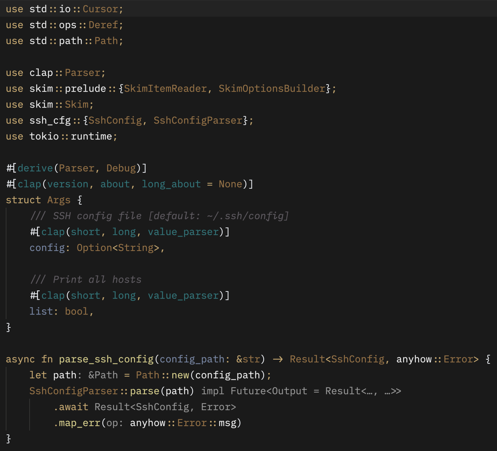

# zed-twilight-theme

Created with https://zed.dev/blog/user-themes-now-in-preview

Thanks to these themes:

- Visual Studio Code Predawn Twilight
- Intellij Twilight

Place `twilight.json` in `~/.config/zed/themes`, restart Zed and select it from the command palette (`Cmd+Shift+P`) or (`Cmd+K Cmd+T`).

